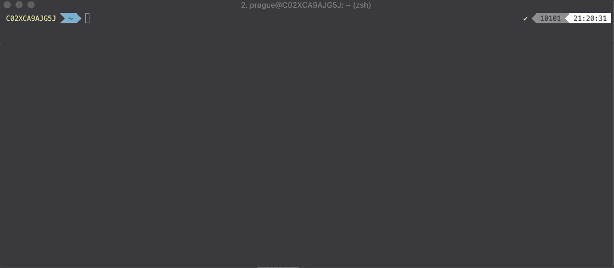

# IndyJump 
IndyJump is tool manage `libindy`, `libvcx` and `libnullpay` libraries on your system. 
`Indyjump` will help you to compile `indy-sdk` binaries and provision them with a custom tag. 

Therefore you can quickly jump between different version of your `indy-sdk` binaries.




# Example workflow
- You might checkout `1.8.2` revision of `indy-sdk` repo. 
- Now you to compile all the binaries and use them from your project
- Instead of compiling manually and copying the artifact to `/usr/local/lib`
 or `/usr/local/lib` you will use `indyjump`
- Simply run `ijcreate foobar1.8.2`. It will:
	- Enter currently checked out indy-sdk repo 
	- Compile `libindy`, `libvcx`, `libnullpay`
	- Track these compiled binaries in dedicated `indyjump` directory as 
	version `foobar1.8.2`
	- Create symlinks to these binaries in your system library directory 
- Done!
- Later you'll decide to switch to your own version of binaries you've compiled
 yesterday. 
- You'd do that by running: `ijump 1.8.1.withMyChanges`


# Installation OSX 
- Checkout repo

`git clone https://github.com/Patrik-Stas/indyjump indyjump`
- Inspect installation script (copies indyjump scripts to `/usr/local/bin`)

`./indyjump/install.sh`

- Run installation script (for OSX) `./indyjump/install.sh`
- Run installation script (for Linux) `sudo ./indyjump/install.sh`


- Setup environment variable `INDY_SDK_SRC` to path pointing to root directory of IndySDK repository on your machine,
 for example
 
`export INDY_SDK_SRC=$HOME/dev/hyperledger/indy-sdk`

- Put it to your `.bashrc`/`.bashprofile` to have it always set up automatically

`echo 'export INDY_SDK_SRC=<path_to_your_indysdk>' >> ~/.bashrc`


sudo INDY_SDK_SRC="$INDY_SDK_SRC" ijcreate boo

# Commands
- On OSX you can use all commands straight away.
- On Linux, you will have to use `sudo`, because scripts are manipulating protected directory `/usr/lib`.
Your `sudo` will not see `INDY_SDK_SRC` variable by default, so you either run indyjump commands as 

    - `sudo -E <indjump command>` to pass env variable from current bash session
    - `sudo INDY_SDK_SRC="$INDY_SDK_SRC" <indjump command>` to pass only `INDY_SDK_SRC` value

### `ijstatus`
##### Displays information about active indy provision
```
> ijstatus
1.7.0    :::   libindy   libvcx   libnullpay
1.8.0    :::   libindy   libvcx   libnullpay
1.8.1    :::   libindy   libvcx   libnullpay
> 1.8.2  :::  >libindy   libvcx   libnullpay
latest   :::   libindy   libvcx   libnullpay
master   :::   libindy   libvcx   libnullpay
> patrik :::   libindy  >libvcx  >libnullpay
```


### `ijump <provision-name>` 
##### Changes used provision for all libraries - `libindy`, `libvcx` and `libnullpay`
```
> ijump experiment

Version of 'libindy' changed to 'experiment'
Version of 'libvcx' changed to 'experiment'
Version of 'libnullpay' changed to 'experiment'
```

### `ijump-one "libindy"|"libvcx"|"libnullpay" <provision-name>` 
##### Changes active provision for library
```
> ijump-one libindy master

Version of 'libindy' changed to 'master'
```

### `ijadd <provision-name>` 
##### Provisions compiled binaries found indy-sdk directory under given name 
```
> ijadd  latest

Will take library at: /Users/prague/dev/hyperledger/indy-sdk/libindy/target/debug/libindy.dylib
The binary will be copied to: /usr/local/lib/indyjump/latest-libindy.dylib
Proovisioned libindy with tag 'latest'
Will take library at: /Users/prague/dev/hyperledger/indy-sdk/vcx/libvcx/target/debug/libvcx.dylib
The binary will be copied to: /usr/local/lib/indyjump/latest-libvcx.dylib
Proovisioned libvcx with tag 'latest'
Will take library at: /Users/prague/dev/hyperledger/indy-sdk/libnullpay/target/debug/libnullpay.dylib
The binary will be copied to: /usr/local/lib/indyjump/latest-libnullpay.dylib
Proovisioned libnullpay with tag 'latest'
```

### `ijadd-one "libindy"|"libvcx"|"libnullpay" <provision-name>`
##### Provisions compiled binary for selected library found indy-sdk directory under given name

```
> ijadd-one libvcx latest

Will take library at: /Users/prague/dev/hyperledger/indy-sdk/vcx/libvcx/target/debug/libvcx.dylib
The binary will be copied to: /usr/local/lib/indyjump/latest-libvcx.dylib
Proovisioned libvcx with tag 'latest'
```

### `ijcreate <provision-name>`
##### Compiles binaries in IndySDK repo, provisions them under selected name and activates this provision
```
> ijcreate experiment

Building 'libindy' at /Users/prague/dev/hyperledger/indy-sdk/libindy/target/debug
    Finished dev [unoptimized + debuginfo] target(s) in 0.53s
Artefacts at /Users/prague/dev/hyperledger/indy-sdk/libindy/target/debug
-rw-------    2 prague  staff   116M Mar 26 16:00 libindy.a
-rw-------    1 prague  staff    10K Apr  2 18:53 libindy.d
-rwx--x--x    2 prague  staff    38M Mar 26 16:00 libindy.dylib
-rw-------    2 prague  staff   110M Mar 26 16:00 libindy.rlib
Will take library at: /Users/prague/dev/hyperledger/indy-sdk/libindy/target/debug/libindy.dylib
The binary will be copied to: /usr/local/lib/indyjump/experiment-libindy.dylib
Proovisioned libindy with tag 'experiment'
Version of 'libindy' changed to 'experiment'
Building 'libnullpay' at /Users/prague/dev/hyperledger/indy-sdk/libnullpay/target/debug
    Finished dev [unoptimized + debuginfo] target(s) in 0.15s
Artefacts at /Users/prague/dev/hyperledger/indy-sdk/libnullpay/target/debug
-rw-------   2 prague  staff    13M Mar 26 16:00 libnullpay.a
-rw-------   1 prague  staff   1.5K Apr  2 18:53 libnullpay.d
-rwx--x--x   2 prague  staff   2.6M Mar 26 16:00 libnullpay.dylib
-rw-------   2 prague  staff   8.6M Mar 26 16:00 libnullpay.rlib
Will take library at: /Users/prague/dev/hyperledger/indy-sdk/libnullpay/target/debug/libnullpay.dylib
The binary will be copied to: /usr/local/lib/indyjump/experiment-libnullpay.dylib
Proovisioned libnullpay with tag 'experiment'
Version of 'libnullpay' changed to 'experiment'
Building 'libvcx' at /Users/prague/dev/hyperledger/indy-sdk/vcx/libvcx/target/debug
    Finished dev [unoptimized + debuginfo] target(s) in 0.64s
Artefacts at /Users/prague/dev/hyperledger/indy-sdk/vcx/libvcx/target/debug
-rw-r--r--    2 prague  staff   156M Apr  2 17:45 libvcx.a
-rw-------    1 prague  staff   7.1K Apr  2 18:53 libvcx.d
-rwxr-xr-x    2 prague  staff    35M Apr  2 17:45 libvcx.dylib
-rw-r--r--    2 prague  staff    81M Apr  2 17:45 libvcx.rlib
Will take library at: /Users/prague/dev/hyperledger/indy-sdk/vcx/libvcx/target/debug/libvcx.dylib
The binary will be copied to: /usr/local/lib/indyjump/experiment-libvcx.dylib
Proovisioned libvcx with tag 'experiment'
Version of 'libvcx' changed to 'experiment'

1.7.0        :::   libindy   libvcx   libnullpay
1.8.0        :::   libindy   libvcx   libnullpay
1.8.1        :::   libindy   libvcx   libnullpay
1.8.2        :::   libindy   libvcx   libnullpay
latest       :::   libindy   libvcx   libnullpay
master       :::   libindy   libvcx   libnullpay
> experiment :::  >libindy  >libvcx  >libnullpay
```


### `ijcompile-one "libindy"|"libvcx"|"libnullpay"`
##### Compiles selected library by using the code in IndySDK directory
```
> ijcompile-one libindy

Building 'libindy' at /Users/prague/dev/hyperledger/indy-sdk/libindy/target/debug
Finished dev [unoptimized + debuginfo] target(s) in 0.58s
Artefacts at /Users/prague/dev/hyperledger/indy-sdk/libindy/target/debug
-rw-------    2 prague  staff   116M Mar 26 16:00 libindy.a
-rw-------    1 prague  staff    10K Apr  2 18:50 libindy.d
-rwx--x--x    2 prague  staff    38M Mar 26 16:00 libindy.dylib
-rw-------    2 prague  staff   110M Mar 26 16:00 libindy.rlib
```


# Compatibility 
- Tested on `OSX Mojave`, `Ubuntu 16.04.5 LTS`
- Does not support `Windows`.
